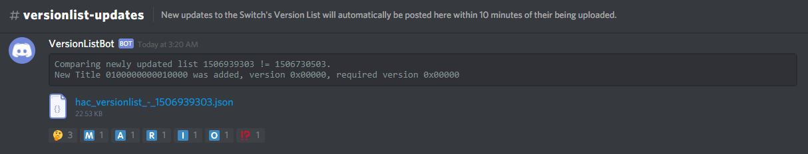

HacVersionListBot
=====

Versionlist update tracker for the Nintendo Switch.

To use: Dump your Nintendo switch's client certificate, and convert it to .p12
format with the password "switch", and replace resources/ConsoleCert.p12 with it.

For Discord integration, replace the discord webhook url string resource with
a webhook for your channel.

**Licensing:**

This software is licensed under the terms of the GPLv3.  
You can find a copy of the license in the LICENSE file.